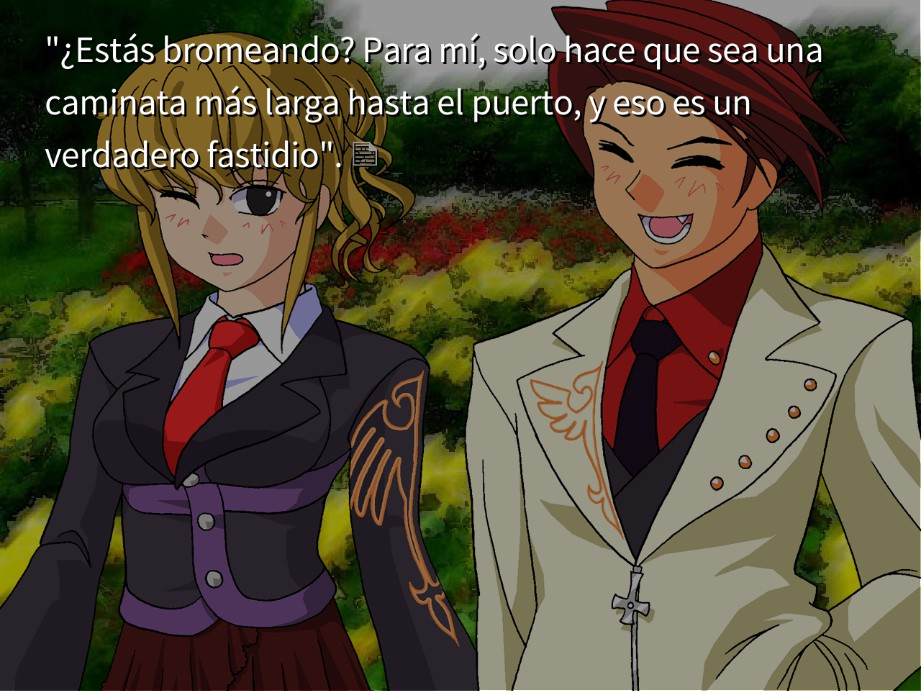
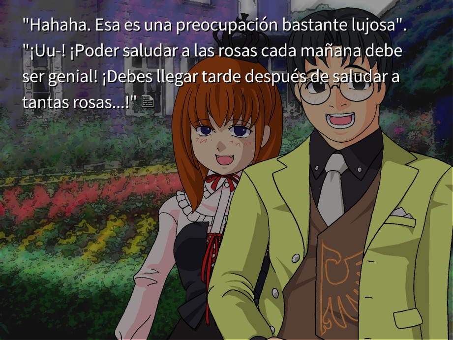
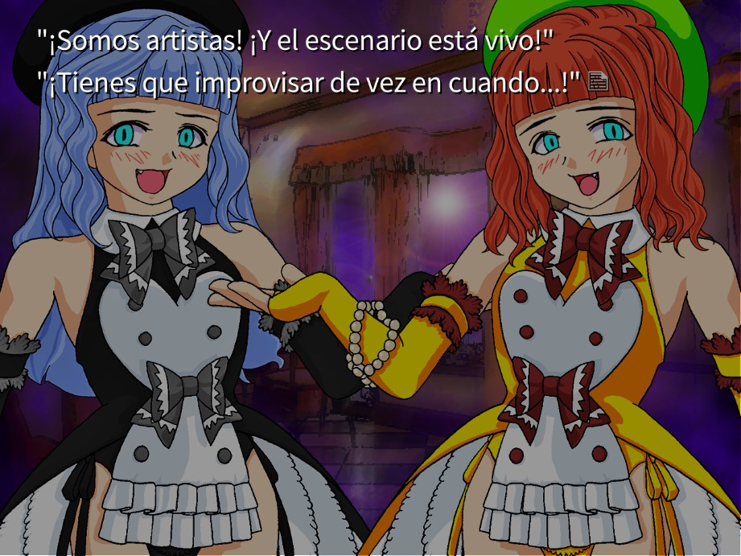
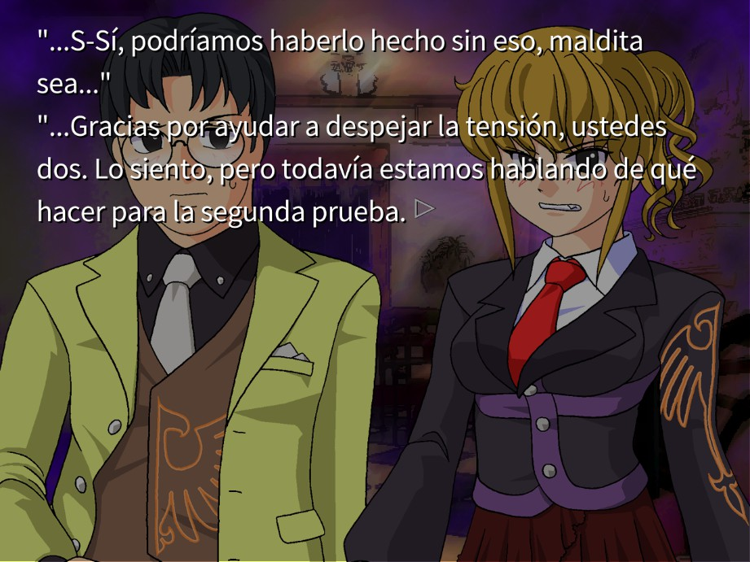
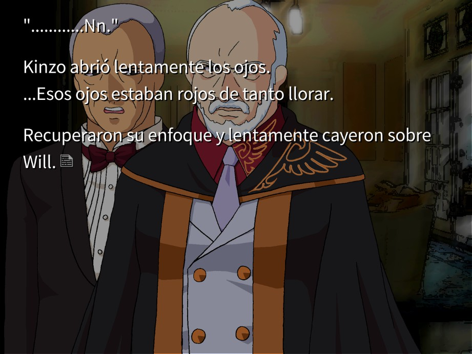
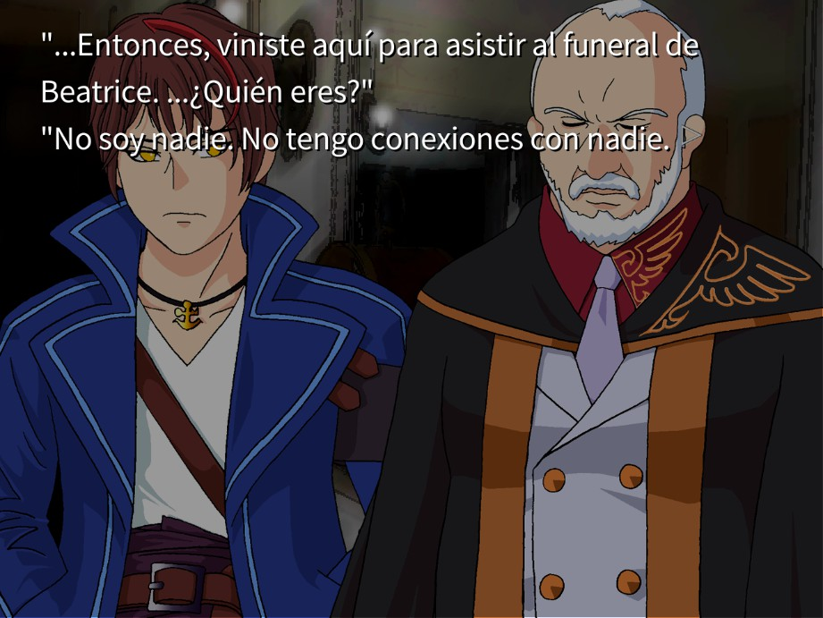

# Umineko When They Cry Chiru - Traducción al español

Traducción al español de Umineko Chiru para Steam.

## Estrategia de traducción

Únicamente se cambiarán los valores de la traducción al inglés de MangaGamer al español, por lo tanto, **solamente se modificarán las líneas que poseen `langen`**.

## ¿Cómo contribuir?

Para contribuir lo recomendable sería enviar un correo personal a `ignacioruedaboada@gmail.com` con asunto `Traducción Umineko Chiru Steam`, pero también es posible hacerlo enviando una **pull request** indicando la línea de inicio y final de modificación.

## Estado de la traducción

#### Líneas alcanzadas:

- 10 000: SI
- 50 000: SI
- 100 000: SI
- 150 000: SI
- 200 000: SI
- 250 000: NO
- 264 452: NO

### Porcentaje:

- Avance total: 92.46/100%

### Screenshots

_Alerta_: Las imágenes podrían contener spoilers.

  
Imagen 01

  
Imagen 02

  
Imagen 03

  
Imagen 04

  
Imagen 05

  
Imagen 06

